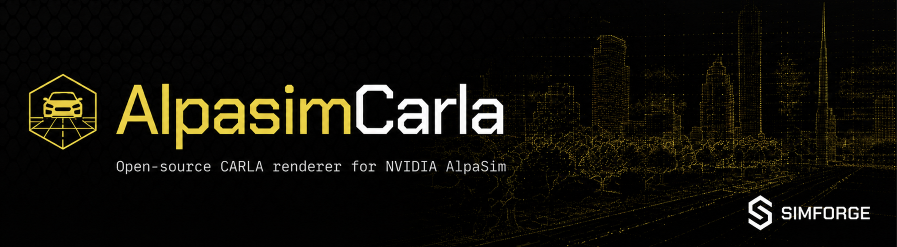

<p align="center">
  
</p>

A CARLA-backed renderer for [NVIDIA AlpaSim](https://github.com/NVIDIA/alpasim).
It implements AlpaSim's `SensorsimService` gRPC contract, so an AlpaSim driver
policy (Alpamayo 1.5, Transfuser, your own) can drive closed-loop in CARLA
worlds without any changes to AlpaSim's runtime, controller, physics, or
scorers.

**Pins:** AlpaSim commit `a1f05bb628f3` (proto v0, `alpasim_grpc` 0.54.0) ·
Python 3.10–3.12 (bridge) / 3.12 (AlpaSim) · tested on NVIDIA A100 with CARLA
0.9.16 in Docker (`-RenderOffScreen`). License: Apache-2.0.

The CARLA version is **not** a repository-wide pin: each scene manifest
declares the `carla_version` it was recorded against, and the bridge refuses
to start against a server that does not match. See
[Targeting a CARLA server that is not stock 0.9.16](#targeting-a-carla-server-that-is-not-stock-0916).
CARLA 0.10 support is written but **unverified** — no 0.10 server has been
reached yet; `pytest tests/ -m carla` is the acceptance suite for it.

## How it works

If you already know AlpaSim, the one-line summary: this is an out-of-process
`SensorsimService` implementation; AlpaSim dictates every pose, CARLA renders
them. If you don't, read on — this section assumes no prior knowledge of
protobuf, AlpaSim, or CARLA internals.

### Protobuf and gRPC in one paragraph

A `.proto` file declares typed messages (fields, types, numbers) and services
(named remote calls with request/response message types). `protoc` compiles it
into Python classes that serialize to a compact wire format; gRPC then serves
those calls over HTTP/2 so a client in one process can call a server in
another — across languages or, as here, across Python versions. The `.proto`
files are the entire contract. AlpaSim's renderer contract is
`SensorsimService` (8 RPCs, vendored under `proto/alpasim_grpc/v0/`); this
library is a server that fulfills it.

### The full picture

AlpaSim is not one program — it is a set of services, each its own
process/container, composed and launched by `alpasim_wizard` (a Hydra CLI).
Every arrow below is a gRPC call.

```
┌──────────────────────────────────────────────────────────────────────────────┐
│                           AlpaSim  (Python 3.12)                             │
│                                                                              │
│                      ┌─────────────────────────────────┐                     │
│                      │             RUNTIME             │                     │
│                      │  the single owner of the world: │                     │
│                      │  • simulation clock (µs)        │                     │
│                      │  • ego pose history             │                     │
│                      │  • traffic trajectories         │                     │
│                      │  • camera trigger schedule      │                     │
│                      │  • logs everything to .asl      │                     │
│                      └──┬─────────┬─────────┬───────┬──┘                     │
│        render_rgb       │         │         │       │                        │
│        get_available_*  │  drive()│  run_controller_ │ simulate()            │
│        get_version      │         │  and_vehicle()   │                       │
│            │            │         ▼         ▼        ▼                       │
│            │            │  ┌───────────┐ ┌─────────────┐ ┌────────────┐      │
│            │            │  │  DRIVER   │ │ CONTROLLER  │ │ TRAFFICSIM │      │
│            │            │  │ the policy│ │ MPC tracker │ │ simulates  │      │
│            │            │  │ (Alpamayo,│ │ + vehicle   │ │ or replays │      │
│            │            │  │ Transfuser│ │ dynamics    │ │ traffic    │      │
│            │            │  │ …) on GPU │ │ model       │ │ (optional) │      │
│            │            │  └───────────┘ └─────────────┘ └────────────┘      │
│            │            │                                                    │
│            │            │  PHYSICS service (terrain-height queries) exists   │
│            │            │  too, but it loads NVIDIA per-scene artifacts, so  │
│            │            │  CARLA runs skip it (flat-ground assumption).      │
└────────────┼────────────┼────────────────────────────────────────────────────┘
             │ gRPC: SensorsimService on :50051
             ▼
┌──────────────────────────────────────────────────────────────────────────────┐
│                    alpasim-carla bridge  (Python 3.10)                       │
│                                                                              │
│  the render_rgb pipeline, in order:                                          │
│   1. server.py    validate request; explicit errors only (unknown scene →    │
│                   NOT_FOUND with the available list, unsupported camera →    │
│                   INVALID_ARGUMENT naming the field)                         │
│   2. scenes.py    scene_id → manifest: which CARLA map, the camera rig,      │
│                   the actor table (labels + bbox dims), the world anchor     │
│   3. registry.py  diff request.dynamic_objects against live CARLA actors:    │
│                     unseen track_id → spawn   (blueprint from label + dims)  │
│                     known  track_id → set_transform (teleport)               │
│                     absent track_id → destroy                                │
│   4. cameras.py   CameraSpec → CARLA pinhole FOV (ftheta/fisheye only with   │
│                   the explicit --allow-pinhole-approximation flag)           │
│   5. frames.py    convert every pose: ENU right-handed → Unreal left-handed, │
│                   optical camera axes → UE camera axes, bbox-center →        │
│                   actor-pivot offset                                         │
│   6. world.py     place the pooled RGB sensor → world.tick() once → take     │
│                   the frame with that tick's id → encode JPEG/PNG            │
└────────────┬─────────────────────────────────────────────────────────────────┘
             │ CARLA client API (the 0.9.16 wheel matching your server build)
             ▼
┌──────────────────────────────────────────────────────────────────────────────┐
│                    CARLA 0.9.16 server  (Unreal Engine)                      │
│  synchronous mode, fixed weather/seed; physics & autopilot OFF for every     │
│  bridge-managed actor. CARLA renders exactly the state AlpaSim dictated —    │
│  it never simulates object motion itself. Two owners of state = divergence. │
└──────────────────────────────────────────────────────────────────────────────┘
```

The mental model for the CARLA side: **AlpaSim moves the puppets, CARLA takes
the photo.** The bridge's only memory between calls is the track-id registry
in step 3.

### One control step, end to end

At the default 10 Hz control rate, every 100 ms of simulated time looks like
this (4 cameras for the Alpamayo drivers):

```
 RUNTIME                BRIDGE + CARLA              DRIVER            CONTROLLER
    │
    │ interpolate ego + traffic poses at the camera trigger window
    │
    │ render_rgb(cam 1) ──▶ sync actors, place
    │ render_rgb(cam 2) ──▶ camera, tick once,
    │ render_rgb(cam 3) ──▶ capture, encode
    │ render_rgb(cam 4) ──▶
    │ ◀── image_bytes ×4 ──
    │
    │ submit images + ego-motion history ─────▶ policy forward
    │ ◀──────── planned trajectory ─────────── pass (GPU)
    │
    │ run_controller_and_vehicle(plan) ──────────────────────────▶ MPC tracks
    │ ◀──────────── new ego pose ──────────────────────────────── the plan,
    │                                                             vehicle model
    │ advance clock, append to .asl, repeat                       integrates
```

Note what the bridge does *not* do: it never integrates motion, never decides
where anything is, never advances time. Each `render_rgb` request is complete
and self-describing — object poses, camera pose, intrinsics, time window,
output format.

### Session startup

Before the loop starts, the runtime probes the renderer:

1. `get_version` — must report the pinned contract version
   (`grpc_api_version` = `alpasim_grpc` 0.54.0).
2. `get_available_scenes` — the configured `scene_id` must be in the returned
   list (or the renderer may advertise the `"*"` wildcard).
3. `get_available_cameras(scene_id)` — the rig the bridge serves from the
   scene manifest. This is authoritative: AlpaSim's camera config can *modify*
   cameras the renderer reports but cannot *add* ones, so the manifest must
   cover every logical id the driver uses.
4. `get_available_ego_masks` — v0.1 publishes none, which makes the runtime
   disable ego-hood masking; `get_available_trajectories` is never called by
   the runtime at the pinned commit.

Scene data is split deliberately: the **runtime** seeds the session (ego start
pose, route, ground-truth trajectory for scoring) from AlpaSim's own scene
catalog, while the **bridge** only needs its manifest to know what world to
show for that `scene_id` — which CARLA town, where to anchor the recorded
local frame in it, and what each track id looks like.

### Coordinate systems

Every pose crossing the boundary goes through `frames.py` (pure functions,
golden-tested):

| Frame | Convention | Used for |
|---|---|---|
| AlpaSim `local` | right-handed ENU, z-up, meters | all request poses |
| AlpaSim `rig` / `aabb` | x-forward, y-left, z-up; `aabb` origin = bbox center | object poses (`aabb`), camera mounts (`rig`) |
| AlpaSim camera | CV optical: x-right, y-down, z-forward | `sensor_pose` |
| Unreal / CARLA | left-handed, x-forward, y-right, z-up, degrees | everything CARLA-side |

The handedness bridge is `(x, y, z) → (x, −y, z)` for positions and direction
vectors; rotations are transported by mapping the body's forward/right/up axes
and reassembling the CARLA rotator, which keeps the math transparent and
testable. Quaternions are `(w, x, y, z)`, active transforms, standard SE(3)
composition. One subtlety worth knowing: a CARLA actor's transform places its
*pivot*, but AlpaSim object poses give the *bounding-box center* — the
registry compensates per blueprint using `actor.bounding_box.location`.

### Why two Pythons

AlpaSim requires Python 3.12; the CARLA client wheel requires 3.10. Because
the boundary is gRPC, the bridge simply runs as its own 3.10 process. The only
thing installed into AlpaSim's environment is `alpasim-carla-configs` — pure
YAML registering an `alpasim.configs` entry point so `renderer=carla` works as
a wizard flag, wiring the runtime to the bridge's address via
`wizard.external_services.renderer`.

## Components

| Component | What it is |
|---|---|
| `src/alpasim_carla/server.py` | The gRPC server. Implements all 8 `SensorsimService` RPCs against a pluggable backend (CARLA or synthetic). |
| `src/alpasim_carla/world.py` | The CARLA backend: synchronous-mode connection, pooled RGB sensors, the render path (sync actors → place camera → tick → capture → encode). |
| `src/alpasim_carla/registry.py` | Track-id → CARLA actor registry, the bridge's only cross-call state. Unseen id → spawn, known id → teleport, absent id → despawn. Blueprint choice from the scene's actor table (label + bbox dims), with a box-prop fallback — objects are never dropped. |
| `src/alpasim_carla/frames.py` | Pure coordinate math between AlpaSim (right-handed ENU, quaternions) and Unreal (left-handed, degrees), including camera optical-frame handling. No CARLA or gRPC imports; fully unit-tested. |
| `src/alpasim_carla/cameras.py` | Maps `CameraSpec` intrinsics to CARLA's pinhole camera. Non-pinhole models (ftheta, fisheye, distortion, rolling shutter) fail explicitly unless `--allow-pinhole-approximation` is set. |
| `src/alpasim_carla/scenes.py` + `scenes/` | Scene manifests (YAML): `scene_id` → CARLA map, camera rig served by `get_available_cameras`, actor table, world anchor. `scenes/examples/` has ready-made scenes on stock towns. |
| `src/alpasim_carla/aslio.py` | Reader for AlpaSim `.asl` rollout logs (length-prefixed protobuf), used by the replay tools. |
| `src/alpasim_carla/_proto/`, `proto/` | The pinned AlpaSim protos (vendored, Apache-2.0, attribution in `proto/README.md`) and generated stubs. |
| `configs_pkg/` | `alpasim-carla-configs`: a pure-YAML package registering an `alpasim.configs` entry point, which makes `renderer=carla` a flag for AlpaSim's wizard. This is the only thing that touches AlpaSim's environment. |
| `tools/` | `replay_contract.py` (replay recorded traffic against the servicer, no CARLA), `replay_render.py` (same, real rendering + checks), `validate_rollout.py` (closed-loop run validation + video), `record_scene.py` (record CARLA drives into test fixtures), `gen_protos.sh`. |
| `docs/CONTRACT.md` | Per-RPC contract: every field consumed/produced, units, coordinate frames. PRs that change behavior must change it. |
| `evidence/` | Artifacts from the validation gates (G0–G4): replay reports, render metrics, closed-loop summaries, transcripts. |

## Install

```bash
# bridge (Python 3.10 env)
pip install "alpasim-carla[carla]"

# config shim (into AlpaSim's Python 3.12 env)
pip install alpasim-carla-configs        # or: pip install -e configs_pkg/
```

Custom CARLA builds: the PyPI `carla` wheel only speaks to stock 0.9.16. For
a custom server build, install the client wheel shipped inside its image:

```bash
CID=$(docker create <your-carla-image>) && \
  docker cp "$CID":/workspace/PythonAPI/carla/dist/. /tmp/carla-dist && \
  docker rm "$CID" && pip install /tmp/carla-dist/carla-0.9.16-cp310-cp310-linux_x86_64.whl
```

## Quickstart

1. Start a CARLA 0.9.16 server (or use one you already have):

   ```bash
   alpasim-carla launch-carla --image carlasim/carla:0.9.16 \
       --server-bin /home/carla/CarlaUE4.sh --gpu 0 --rpc-port 3000
   ```

2. Start the bridge:

   ```bash
   alpasim-carla serve --port 50051 --scenes-dir scenes/examples \
       --carla-host 127.0.0.1 --carla-port 3000 \
       --allow-pinhole-approximation
   ```

3. Run AlpaSim against it (from your AlpaSim checkout):

   ```bash
   uv run alpasim_wizard \
       --config-dir /path/to/alpasim-carla/configs_pkg/alpasim_carla_configs/configs \
       deploy=local topology=1gpu driver=alpamayo1_5 renderer=carla \
       'wizard.external_services.renderer=["<host-ip>:50051"]' \
       wizard.run_method=NONE wizard.log_dir=./out \
       runtime.endpoints.physics.skip=true \
       runtime.simulation_config.physics_update_mode=NONE \
       runtime.simulation_config.n_rollouts=1
   cd ./out && docker compose -f docker-compose.yaml \
       up --no-build --exit-code-from runtime-0 --remove-orphans
   ```

   `--config-dir` is optional if `alpasim-carla-configs` is installed in the
   wizard's env. `wizard.run_method=NONE` generates the compose file without
   running it; drop it to let the wizard launch compose itself.

The exact validated end-to-end commands and their artifacts are in `PLAN.md`
§4 and `evidence/`.

## Error policy

- Unknown `scene_id` → `NOT_FOUND`, listing available scenes.
- Unsupported camera model/distortion/shutter → `INVALID_ARGUMENT` naming the
  field; `--allow-pinhole-approximation` is the only degradation path, and it
  is opt-in.
- Unmappable object category → documented box-prop fallback plus a structured
  warning; never a silent skip.
- `render_lidar` → `UNIMPLEMENTED` (out of scope for v0.1).

## Scope and roadmap

v0.1: `render_rgb`, camera-only `render_aggregated`, all discovery RPCs,
pinhole cameras (+ explicit ftheta/fisheye approximation), example scenes on
stock towns, scene tooling, Docker.

Roadmap: lidar, distortion post-warp, rolling-shutter simulation, instance
pooling, CARLA-backed traffic/physics services, Windows.

## Targeting a CARLA server that is not stock 0.9.16

There is no built-in blueprint table. There used to be one, curated for CARLA
0.9.16, reachable by simply not passing a listing — and on CARLA 0.10 none of
its eight vehicle ids exist verbatim, both two-wheeler categories were
removed, and several survivors carry a `vehicle.ue4.<make>.<model>` id, so
every lookup missed and the ladder degraded each actor to a prop. A run like
that renders boxes to the driver and scores them, which is only visible in
the video afterwards, so `default_catalog()` now refuses and names the
generator instead. List the server first, then serve against the listing:

```bash
python tools/list_blueprints.py --carla-port 3000 --map Town10HD_Opt \
    --out blueprints_0.10.txt          # also prints the day-one probe

alpasim-carla serve --backend carla --carla-port 3000 \
    --blueprint-catalog blueprints_0.10.txt ...
```

Two behaviours changed:

- **The version check is a hard gate, and the scene manifest decides what it
  demands.** Each manifest declares `carla_version:` — the shipped 0.9.16
  examples say `'0.9.16'`, a Belmont manifest says `'0.10.0'` — and the
  bridge refuses to start against a server that does not match. Manifests
  that disagree with each other are an error: one process serves one server.
  `--expect-carla-version` overrides them all; an empty string skips the
  check. A server reporting a git hash rather than a release (the G3 evidence
  server reported `fa7751a`) is refused with a message naming the manifest
  field that would accept it deliberately.

  **The three manifests in `scenes/examples/` declare `'0.9.16'`, so a 0.10
  server will refuse them. That is by design, not a bug** — those scenes were
  authored against stock 0.9.16 towns. To use them against a 0.10 server,
  either change their `carla_version` to the version you are running, or pass
  `--expect-carla-version ''` to accept whatever the server reports.
- **Map names are compared as exact basenames**, ignoring any path and a
  trailing `_Opt`. The previous `current.endswith(scene.carla_map)` accepted
  a manifest name that was merely a suffix of the server's map, so a manifest
  saying `Belmont` silently matched a server serving `Munich_Belmont`.

Gate G2 now audits the ladder before a rollout: `audit_scene_blueprints`
resolves every actor whose label is a vehicle, pedestrian or two-wheeler
synonym and fails the gate if any would render as the terminal prop. The
result is recorded as `fallback_actors` in the run metrics, so a run that
passed with boxed actors is visible in the evidence rather than found
later in the video. CARLA 0.10 removed the motorcycle and bicycle
categories outright, so a scene containing cyclists will fail this gate
on 0.10 until they are filtered out of the scene package.

`set_weather` is now attempted once and tolerated if it fails: CARLA 0.10
documents weather as unsupported on the release map, and no CARLA source
states whether the call raises or is a silent no-op.

## Development

```bash
make hooks                              # INSTALL THIS FIRST - see below
pip install -e ".[dev]"                 # carla not required for the test suite
pytest tests/ -m "not carla"            # simulator-free suite
pytest tests/ -m carla                  # acceptance suite; needs a server
pytest tests/ -m carla --run-mutating   # also reloads the map (see below)
tools/gen_protos.sh                     # regenerate vendored stubs
```

The vendored protos are pinned at `alpasim_grpc` 0.54.0 while upstream is at
0.55.0. `tools/proto_equivalence.py` compiles both generations and encodes a
corpus of render-path messages under each, asserting byte equality for the
messages they share — proof that the sensorsim seam is unaffected by the bump,
independent of the new RPCs (`batch_render_rgb`, `get_loaded_scenes`) that
0.55.0 adds and the `traffic.proto` changes it makes:

```bash
python tools/proto_equivalence.py --upstream /path/to/alpasim/src/grpc/alpasim_grpc/v0
ALPASIM_PROTO_DIR=/path/to/alpasim/src/grpc/alpasim_grpc/v0 pytest tests/
```

Both generations declare the same proto package, so they cannot be imported
into one interpreter; each encodes in its own subprocess.

Tests marked `carla_mutating` change server state — currently just the
`load_world` timing check — and are **skipped unless `--run-mutating`** is
passed, so `-m carla` is idempotent against a server that may be hosting
campaign runs. A marker alone would not achieve this, since `-m carla` selects
everything carrying the `carla` marker; the flag is what gates them. The
reload test also refuses to run if the server's entry map is not the target,
and restores it afterwards, so it can never leave a shared server somewhere
nobody asked for. It records `load_world_seconds` as a test property, which is
the only measurement anywhere of how long a UE5 map load actually takes.

### Install the pre-commit hook

`make hooks` installs a hook that runs `make test` and **refuses the commit
on any failure**. Two commits in this repository's history were made on a
red suite and had to be corrected by follow-ups; in the second case the
failing count was printed directly above the commit and went unread. A
check that reports depends on a reader, so this one blocks.

It is not installed by cloning — `make hooks` is a step, and a clone that
skipped it is a visible omission rather than a silent one. `--no-verify`
bypasses it deliberately, and the required status check on `main` is the
second layer that does not depend on any of this.

Test counts quoted in commit messages come from `make count`, or from
`.git/LAST_TEST_COUNT` which the hook writes. Never typed.

### The frame conversions live in their own distribution

`packages/simforge-frames/` holds the AlpaSim ↔ Unreal conversions, with
`numpy` as its only dependency. `alpasim_carla.frames` re-exports it
verbatim, and a test asserts the re-exports are the **same function
objects** — without that the shim would drift into a second implementation
the first time someone fixed a y-flip in one place.

It is separate because `simforge-closed-loop` needs these conversions and
cannot import this package: `alpasim_carla.scenes` loads the 0.54.0 proto
stubs, that repo carries 0.55.0, and protobuf's descriptor pool is global.
See `simforge-closed-loop/docs/adr/ADR-017`.

### Acceptance tests

`tests/test_carla_acceptance.py` holds the day-one checks for a 0.10 server as
executable acceptance criteria rather than prose. They are configured by
`CARLA_HOST`, `CARLA_PORT`, `CARLA_MAP`, `CARLA_EXPECT_VERSION` and
`ALPASIM_BLUEPRINT_CATALOG`, and **none of them has been run against a 0.10
server yet.**
